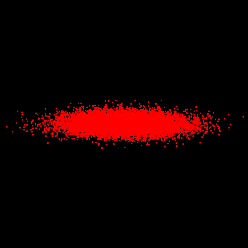

# NEOviz

NEOviz is an interactive visualization system that uses the software [OpenSpace](http://openspaceproject.com) to visualize the trajectory uncertainties of near-Earth objects  (NEO) in the Solar system. This repository contains the source code for data generation (_i.e._ orbit propagation), preprocessing (_i.e._ uncertainty tube computation), and analysis (_i.e._ impact corridor computation, cut-plane plotting) of the uncertainty visualiation pipeline.

The implementation is described in "NEOviz: Uncertainty-Driven Visual Analysis of Asteroid Trajectories" (under review). This project is a collaboration between the [Immersive Visualization](https://immvis.github.io/) group at Linköping University in Sweden and the [B612 Foundation](https://b612foundation.org/).

[](https://www.python.org)
[](https://opensource.org/licenses/BSD-3-Clause)

<!-- []() -->

## Installation

For orbit propagation (the /orbit_propagation directory), the code is tested with Python 3.11 and Ubuntu 22.04.4. Note that some of the dependencies of `adam_core` are currently only available on Linux, so a Linux distribution is highly recommended for this part of the computation. You can either download/clone the repository and install the required packages from scratch or use the provided Anaconda environment. 

### Using Anaconda and the environment.yml file
To use Anaconda to create the python environment from the _environment.yml_ file follow theese instructions:

1. Create the python environment with the commnad `conda env create -n neoviz -f ./../environment.yml`
1. Activate the new python environment with `conda activate neoviz`

Unfortunatly, the library [choldate](https://github.com/modusdatascience/choldate) is not currently included in the environment and requier seperate installation. You can see instructions for that [here](#how-to-install-choldate). Note that choldate is only a required dependency for tube generation and not for the orbit propagation.

### Create the environment from scratch
If you use `conda`, a fresh environment can be created as follows: 

```shell
conda create -n propagate_obits_py311 python=3.11
conda activate propagate_orbits_py11
pip install -r requirements-linux.txt
```

To be able to propagate orbits, you will need to install PYOORB via conda:
```shell
conda install -c conda-forge openorb
```

Other important python dependencies:
 - [pandas](https://pandas.pydata.org/)
 - [adam_core](https://b612.ai/opensource/adam_core/)
 - [mpcq](https://github.com/B612-Asteroid-Institute/mpcq)
 - [astropy](https://www.astropy.org/)
 - [pyarrow](https://pypi.org/project/pyarrow/)
 - [quivr](https://pypi.org/project/quivr/)


For the uncertainty tube computation and analysis (the /src directory), the code is tested with Python 3.11 and Windows-64. 

```shell
pip install -r requirements.txt
```

Important python dependencies:
 - [numpy](https://numpy.org/)
 - [matplotlib](https://matplotlib.org/)
 - [spiceypy](https://pypi.org/project/spiceypy/)
 - [astropy](https://www.astropy.org/)

The code uses [SPICE kernels](https://naif.jpl.nasa.gov/naif/data.html) for many computations. The file `/src/meta-kernel.tm` details the three generic kernels we used. You need to visit the [Generic Kernels](https://naif.jpl.nasa.gov/naif/data_generic.html) on the SPICE website, download each of the text files, and create the file structure as described in the `KERNEL_TO_LOAD` section in the `/src/meta-kernel.tm` file.
The code then loads the SPICE data for later use. In general, if you want to learn more about the data contained in each kernel file, read the `aareadme.txt` files in each directory on the SPICE website.

### How to install [choldate](https://github.com/modusdatascience/choldate)
Follow the instructions on the [GitHub](https://github.com/modusdatascience/choldate) page. Either install it via the command `pip install git+git://github.com/jcrudy/choldate.git` or by building from source:

1. git clone git://github.com/jcrudy/choldate.git
1. cd choldate
1. python setup.py install

### Using Windows Subsystem for Linux (WSL)
The orbit propagation can currently only run in a Linux environment. If you are using a Windows machine, then you can use Windows Subsystem for Linux (WSL) to simulate a Linux environment and run the code in there. 

1. Install WSL by follow the instructions in this [guide](https://learn.microsoft.com/en-us/windows/wsl/install)
1. Install Anaconda in WSL by following this [guide](https://gist.github.com/kauffmanes/5e74916617f9993bc3479f401dfec7da)
1. (Only required for development) Install the WSL extension for VS Code, you can find it [here](https://code.visualstudio.com/docs/remote/wsl)
1. Open a command prompt in the installed WSL Linux environment 
1. Install the gcc compiler for WSL with the command `sudo apt-get install gcc`

### Issues with QT
If you get the message `Could not load the Qt platform plugin "xcb" in "" even though it was found` then you can follow this [post](https://askubuntu.com/questions/1271976/could-not-load-the-qt-platform-plugin-xcb-in-even-though-it-was-found) for a solution.

Essentially you need to install one or more missing packages in QT. To figure out which packages you need you first have to turn on QT debugging with the command `export QT_DEBUG_PLUGINS=1`. Then run your code again and you will get more debug output of what is missing, below is an example output.

<details>
    <summary>Example Output</summary>
    ```shell
    ./orbit_propagation/generated_data/historical/2023 CX1/2023-02-13T02.38.19.001/times_isot.npy
    ['variants_coords_10000.npy']
    ['variants_velo_10000.npy']
    num_samples 10000
    num_time_steps
    80
    (800000, 3)
    length of variants coords list 80
    length of variants coords list [0] 10000
    (10000, 3)
    time step 0
    2023-02-13T02:38:19.001
    Xi shape (3, 10000)
    (4,)
    (4, 4)
    Feasible:  True
    Optimal:  True
    [4.07093583e+07 3.19920717e+09 2.45919784e+09]
    [[-0.40115354  0.89884697 -0.17649352]
    [ 0.87869925  0.32317197 -0.35135096]
    [ 0.25877299  0.2960304   0.91945774]]
    (2, 10000)
    (3,)
    (3, 3)
    Feasible:  True
    Optimal:  True
    saving texture...
    img path ./generated_data/2023 CX1/2023-02-13T02.38.19.001/textures/0.png
    QFactoryLoader::QFactoryLoader() checking directory path "/home/user/anaconda3/envs/neoviz/lib/python3.11/site-packages/PyQt5/Qt5/plugins/platforms" ...
    QFactoryLoader::QFactoryLoader() looking at "/home/user/anaconda3/envs/neoviz/lib/python3.11/site-packages/PyQt5/Qt5/plugins/platforms/libqeglfs.so"
    Found metadata in lib /home/user/anaconda3/envs/neoviz/lib/python3.11/site-packages/PyQt5/Qt5/plugins/platforms/libqeglfs.so, metadata=
    {
        "IID": "org.qt-project.Qt.QPA.QPlatformIntegrationFactoryInterface.5.3",
        "MetaData": {
            "Keys": [
                "eglfs"
            ]
        },
        "archreq": 0,
        "className": "QEglFSIntegrationPlugin",
        "debug": false,
        "version": 331520
    }


    Got keys from plugin meta data ("eglfs")
    QFactoryLoader::QFactoryLoader() looking at "/home/user/anaconda3/envs/neoviz/lib/python3.11/site-packages/PyQt5/Qt5/plugins/platforms/libqlinuxfb.so"
    Found metadata in lib /home/user/anaconda3/envs/neoviz/lib/python3.11/site-packages/PyQt5/Qt5/plugins/platforms/libqlinuxfb.so, metadata=
    {
        "IID": "org.qt-project.Qt.QPA.QPlatformIntegrationFactoryInterface.5.3",
        "MetaData": {
            "Keys": [
                "linuxfb"
            ]
        },
        "archreq": 0,
        "className": "QLinuxFbIntegrationPlugin",
        "debug": false,
        "version": 331520
    }


    Got keys from plugin meta data ("linuxfb")
    QFactoryLoader::QFactoryLoader() looking at "/home/user/anaconda3/envs/neoviz/lib/python3.11/site-packages/PyQt5/Qt5/plugins/platforms/libqminimal.so"
    Found metadata in lib /home/user/anaconda3/envs/neoviz/lib/python3.11/site-packages/PyQt5/Qt5/plugins/platforms/libqminimal.so, metadata=
    {
        "IID": "org.qt-project.Qt.QPA.QPlatformIntegrationFactoryInterface.5.3",
        "MetaData": {
            "Keys": [
                "minimal"
            ]
        },
        "archreq": 0,
        "className": "QMinimalIntegrationPlugin",
        "debug": false,
        "version": 331520
    }


    Got keys from plugin meta data ("minimal")
    QFactoryLoader::QFactoryLoader() looking at "/home/user/anaconda3/envs/neoviz/lib/python3.11/site-packages/PyQt5/Qt5/plugins/platforms/libqminimalegl.so"
    Found metadata in lib /home/user/anaconda3/envs/neoviz/lib/python3.11/site-packages/PyQt5/Qt5/plugins/platforms/libqminimalegl.so, metadata=
    {
        "IID": "org.qt-project.Qt.QPA.QPlatformIntegrationFactoryInterface.5.3",
        "MetaData": {
            "Keys": [
                "minimalegl"
            ]
        },
        "archreq": 0,
        "className": "QMinimalEglIntegrationPlugin",
        "debug": false,
        "version": 331520
    }


    Got keys from plugin meta data ("minimalegl")
    QFactoryLoader::QFactoryLoader() looking at "/home/user/anaconda3/envs/neoviz/lib/python3.11/site-packages/PyQt5/Qt5/plugins/platforms/libqoffscreen.so"
    Found metadata in lib /home/user/anaconda3/envs/neoviz/lib/python3.11/site-packages/PyQt5/Qt5/plugins/platforms/libqoffscreen.so, metadata=
    {
        "IID": "org.qt-project.Qt.QPA.QPlatformIntegrationFactoryInterface.5.3",
        "MetaData": {
            "Keys": [
                "offscreen"
            ]
        },
        "archreq": 0,
        "className": "QOffscreenIntegrationPlugin",
        "debug": false,
        "version": 331520
    }


    Got keys from plugin meta data ("offscreen")
    QFactoryLoader::QFactoryLoader() looking at "/home/user/anaconda3/envs/neoviz/lib/python3.11/site-packages/PyQt5/Qt5/plugins/platforms/libqvnc.so"
    Found metadata in lib /home/user/anaconda3/envs/neoviz/lib/python3.11/site-packages/PyQt5/Qt5/plugins/platforms/libqvnc.so, metadata=
    {
        "IID": "org.qt-project.Qt.QPA.QPlatformIntegrationFactoryInterface.5.3",
        "MetaData": {
            "Keys": [
                "vnc"
            ]
        },
        "archreq": 0,
        "className": "QVncIntegrationPlugin",
        "debug": false,
        "version": 331520
    }


    Got keys from plugin meta data ("vnc")
    QFactoryLoader::QFactoryLoader() looking at "/home/user/anaconda3/envs/neoviz/lib/python3.11/site-packages/PyQt5/Qt5/plugins/platforms/libqwayland-egl.so"
    Found metadata in lib /home/user/anaconda3/envs/neoviz/lib/python3.11/site-packages/PyQt5/Qt5/plugins/platforms/libqwayland-egl.so, metadata=
    {
        "IID": "org.qt-project.Qt.QPA.QPlatformIntegrationFactoryInterface.5.3",
        "MetaData": {
            "Keys": [
                "wayland-egl"
            ]
        },
        "archreq": 0,
        "className": "QWaylandEglPlatformIntegrationPlugin",
        "debug": false,
        "version": 331520
    }


    Got keys from plugin meta data ("wayland-egl")
    QFactoryLoader::QFactoryLoader() looking at "/home/user/anaconda3/envs/neoviz/lib/python3.11/site-packages/PyQt5/Qt5/plugins/platforms/libqwayland-generic.so"
    Found metadata in lib /home/user/anaconda3/envs/neoviz/lib/python3.11/site-packages/PyQt5/Qt5/plugins/platforms/libqwayland-generic.so, metadata=
    {
        "IID": "org.qt-project.Qt.QPA.QPlatformIntegrationFactoryInterface.5.3",
        "MetaData": {
            "Keys": [
                "wayland"
            ]
        },
        "archreq": 0,
        "className": "QWaylandIntegrationPlugin",
        "debug": false,
        "version": 331520
    }


    Got keys from plugin meta data ("wayland")
    QFactoryLoader::QFactoryLoader() looking at "/home/user/anaconda3/envs/neoviz/lib/python3.11/site-packages/PyQt5/Qt5/plugins/platforms/libqwayland-xcomposite-egl.so"
    Found metadata in lib /home/user/anaconda3/envs/neoviz/lib/python3.11/site-packages/PyQt5/Qt5/plugins/platforms/libqwayland-xcomposite-egl.so, metadata=
    {
        "IID": "org.qt-project.Qt.QPA.QPlatformIntegrationFactoryInterface.5.3",
        "MetaData": {
            "Keys": [
                "wayland-xcomposite-egl"
            ]
        },
        "archreq": 0,
        "className": "QWaylandXCompositeEglPlatformIntegrationPlugin",
        "debug": false,
        "version": 331520
    }


    Got keys from plugin meta data ("wayland-xcomposite-egl")
    QFactoryLoader::QFactoryLoader() looking at "/home/user/anaconda3/envs/neoviz/lib/python3.11/site-packages/PyQt5/Qt5/plugins/platforms/libqwayland-xcomposite-glx.so"
    Found metadata in lib /home/user/anaconda3/envs/neoviz/lib/python3.11/site-packages/PyQt5/Qt5/plugins/platforms/libqwayland-xcomposite-glx.so, metadata=
    {
        "IID": "org.qt-project.Qt.QPA.QPlatformIntegrationFactoryInterface.5.3",
        "MetaData": {
            "Keys": [
                "wayland-xcomposite-glx"
            ]
        },
        "archreq": 0,
        "className": "QWaylandXCompositeGlxPlatformIntegrationPlugin",
        "debug": false,
        "version": 331520
    }


    Got keys from plugin meta data ("wayland-xcomposite-glx")
    QFactoryLoader::QFactoryLoader() looking at "/home/user/anaconda3/envs/neoviz/lib/python3.11/site-packages/PyQt5/Qt5/plugins/platforms/libqwebgl.so"
    Found metadata in lib /home/user/anaconda3/envs/neoviz/lib/python3.11/site-packages/PyQt5/Qt5/plugins/platforms/libqwebgl.so, metadata=
    {
        "IID": "org.qt-project.Qt.QPA.QPlatformIntegrationFactoryInterface.5.3",
        "MetaData": {
            "Keys": [
                "webgl"
            ]
        },
        "archreq": 0,
        "className": "QWebGLIntegrationPlugin",
        "debug": false,
        "version": 331520
    }


    Got keys from plugin meta data ("webgl")
    QFactoryLoader::QFactoryLoader() looking at "/home/user/anaconda3/envs/neoviz/lib/python3.11/site-packages/PyQt5/Qt5/plugins/platforms/libqxcb.so"
    Found metadata in lib /home/user/anaconda3/envs/neoviz/lib/python3.11/site-packages/PyQt5/Qt5/plugins/platforms/libqxcb.so, metadata=
    {
        "IID": "org.qt-project.Qt.QPA.QPlatformIntegrationFactoryInterface.5.3",
        "MetaData": {
            "Keys": [
                "xcb"
            ]
        },
        "archreq": 0,
        "className": "QXcbIntegrationPlugin",
        "debug": false,
        "version": 331520
    }


    Got keys from plugin meta data ("xcb")
    QFactoryLoader::QFactoryLoader() checking directory path "/home/user/anaconda3/envs/neoviz/bin/platforms" ...
    Cannot load library /home/user/anaconda3/envs/neoviz/lib/python3.11/site-packages/PyQt5/Qt5/plugins/platforms/libqxcb.so: (libxcb-icccm.so.4: cannot open shared object file: No such file or directory)
    QLibraryPrivate::loadPlugin failed on "/home/user/anaconda3/envs/neoviz/lib/python3.11/site-packages/PyQt5/Qt5/plugins/platforms/libqxcb.so" : "Cannot load library /home/user/anaconda3/envs/neoviz/lib/python3.11/site-packages/PyQt5/Qt5/plugins/platforms/libqxcb.so: (libxcb-icccm.so.4: cannot open shared object file: No such file or directory)"
    qt.qpa.plugin: Could not load the Qt platform plugin "xcb" in "" even though it was found.
    This application failed to start because no Qt platform plugin could be initialized. Reinstalling the application may fix this problem.

    Available platform plugins are: eglfs, linuxfb, minimal, minimalegl, offscreen, vnc, wayland-egl, wayland, wayland-xcomposite-egl, wayland-xcomposite-glx, webgl, xcb.

    Aborted (core dumped)
    ```
</details>

Then you run the commnad `ldd /home/user/anaconda3/envs/neoviz/lib/python3.11/site-packages/PyQt5/Qt5/plugins/platforms/libqeglfs.so | grep "not found"` (replace the path with your own that you can find in the debug output from before) to search for which QT packages are missing, below is an example output.

```shell
libQt5EglFSDeviceIntegration.so.5 => not found
```

This means that you are missing one package and you install it with the command `sudo apt install libqt5charts5-dev`, you might need to google what the name is for the packages you are missing. After all missing packages have been installed you should be able to run the code.

### Issues with numpy
The new version of the adam_core library requires numpy version 2.0.0, and all other packages need to support numpy 2 because of this. If you get issues related to numpy then there might be a package installed that does not support numpy 2, that package then needs to be updated. This [issue](https://github.com/numpy/numpy/issues/26191) lists some libraries that does support numpy 2 and which lowest version is required for it.


## Pipeline

#### Orbit prpagation (linux environment only)
We start by propagating orbits using submission data. See instructions in the "orbit_propagation" directory.

#### Uncertainty tube data generation
We use the output of the orbit propagation step and generate the data for the uncertainty tube. We continue with our exmample of the imminent impactor 2023 CX1. Run the following command.
```shell
python getEllipse.py
```
We output the following file struture:

```
.
└── sampled_data/
    └── impact_corridor/
        └── 2023 CX1/
            └── 2023-02-13T02.38.19.001/
                ├── textures/
                │   ├── 0.png
                │   ├── 1.png
                │   └── ...
                └── tube_data.json
```

The textures are images that encode data about the cutplanes of the uncertainty tube. OpenSpace later applies transfer functions onto these textures to display them in the correct locations and scales in space.



The main function is `getEllipsePerSubmission()` with the following input parameters:
+ variants_dir: the directory of orbit variants from orbit propagation
+ num_sample_ellipse: the number of points we sample from each ellipse cutplane, the default is 50
+ out_dir: output directory
+ sectioned_uncertainty: boolean to determine if we are using the historical (False) or sectioned (True) uncertainty representation
+ plotEllipse: boolean, if True the function will plot the intermediate steps for the computation of each ellipse. It can be useful for debugging purposes.

The data is then saved into a JSON file called `tube_data.json`.

#### Transform json

#### Impact corridor


## License
This repository is provided under the [3-Clause BSD License](https://github.com/fei0324/NEOviz/blob/main/LICENSE).
