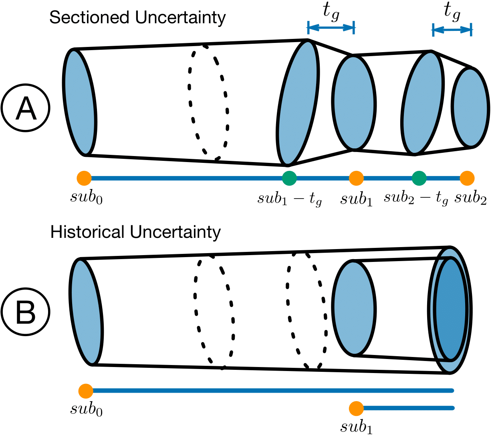

# NEOviz Orbit Propagation

The `mpc_data` and `orbit_fits` directories contain data that we received from our astronomy collaborator:
+ The `mpc_data` folder contains the object's observations and submission history. We use the submission history to determine the order of the observations.
+ The `orbit_fits` folder contains the calcaulated orbits and the associated covariance matrix based on the given observations.

We use the data in the above folders to sample orbit variants and propagate them over time. The difference between _Sectioned Uncertainty_ and _Historical Uncertainty_ is illustrated in the figure below. Please refer to the paper for a more detailed description.



We used the historical uncertainty representation for the Apophis and 2023 CX1 exmaples. For 2012 DA14, we used the sectioned uncertainty representation.

### Objects of Interest

- [2012 DA14](https://ssd.jpl.nasa.gov/tools/sbdb_lookup.html#/?sstr=2012%20DA14) (NEO)  
    Small ~20 m asteroid that passed within ~28,000 km of the Earth's surface on February 15, 2013. This is within the orbital distance of geosynchronous satellites. After this close approach, the orbital class of this object changed from Apollo to Aten.

- [2020 VW](https://ssd.jpl.nasa.gov/tools/sbdb_lookup.html#/?sstr=2020%20VW) (NEO - Potential Impactor)  
    Small ~1 m asteroid with a [cumulative impact probability of 1 in 140](https://cneos.jpl.nasa.gov/sentry/details.html#?des=2020%20VW). First potential impact occurs on November 2, 2074.

- [2000 SG344](https://ssd.jpl.nasa.gov/tools/sbdb_lookup.html#/?sstr=2000%SG344) (NEO - Potential Impactor)  
    A ~40 m asteroid with a [cumulative impact probability of 1 in 370](https://cneos.jpl.nasa.gov/sentry/details.html#?des=2000%20SG344). First potential impact occurs on September 18, 2069. This asteroid exhibis interesting bifurcation with several potential impacts occuring in September 2071.

    - Orbit Fits Generated 

- [2023 CX1](https://ssd.jpl.nasa.gov/tools/sbdb_lookup.html#/?sstr=2023%20CX1) (NEO - Imminent Impactor)  
    An small ~1 m immenent impactor discovered a few hours before impact over the English channel on February 13, 2023. 

    - Orbit Fits Generated - Several orbit fits failed to converge near impact time. 

- [2004 MN4](https://ssd.jpl.nasa.gov/tools/sbdb_lookup.html#/?sstr=apophis)  (NEO/PHA)  
    A ~370 m potentially hazardous asteroid with a close approach occuring on April 13, 2029. During this close approach, Earth will perturb the orbit enough to change the orbit class from Apollo to Aten. This is the closest approach of an asteroid of this size in recorded history and it will be visible to the naked eye. 

    - Orbit Fits Generated - Observations after 2005 are missing.

- [1998 SG172](https://ssd.jpl.nasa.gov/tools/sbdb_lookup.html#/?sstr=ivezic) (MBA - Simple Main Belt Asteroid)
    A ~1 km main belt asteroid with a well known orbit. 

    - Orbit Fits Generated

### Example: 2023 CX1

For an example, we can run the the `historical_uncertainty.py` file with the following command:
```shell
python historical_uncertainty.py
```
The object in this example is the imminent impactor 2023 CX1. We sample 10000 starting points from the submission at 2023-02-13T02.38.19.001 and propagate forward to 2023-02-13T03:40:00.000. We output 10000 orbit variants.

We save the files in the following structure.
.
└── orbit_propagation/
    └── impact_corridor/
        └── 2023 CX1/
            └── 2023-02-13T02.38.19.001/
                ├── orbit_at_submission_i.parquet
                ├── propagated_variants_i.parquet
                ├── times_isot.npy
                ├── variants_coords_10000.npy
                └── variants_velo_10000.npy

+ `times_isot.npy` is the list of times we used for the propagation.
+ `variants_coords_[number of samples].npy` is the coordinates of the orbit variants.
+ `variants_velos_[number of samples].npy` is the velocity of the orbit variants.

We use the above files to perform the uncertainty tube computation. For the impact map/corridor computation, we need kernel files for each of the orbit variants. To create the kernels, we uncommment the last line `create_kernels(...)` in the `getDynamicUncertainty()` function. Then we output a directory `openspace_variants` that contains all the 10000 kernel files.

